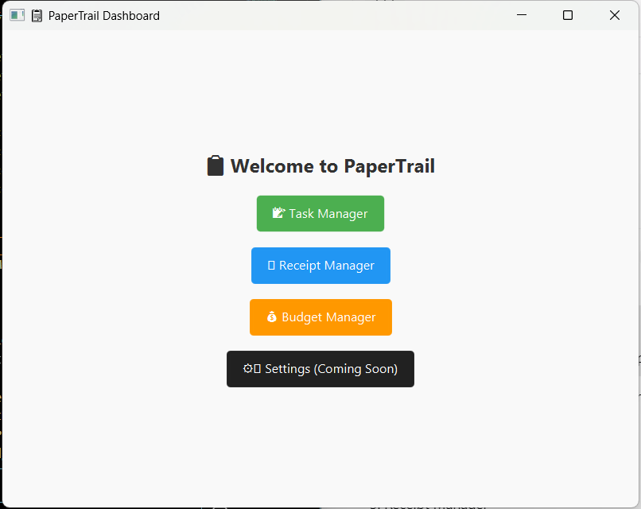
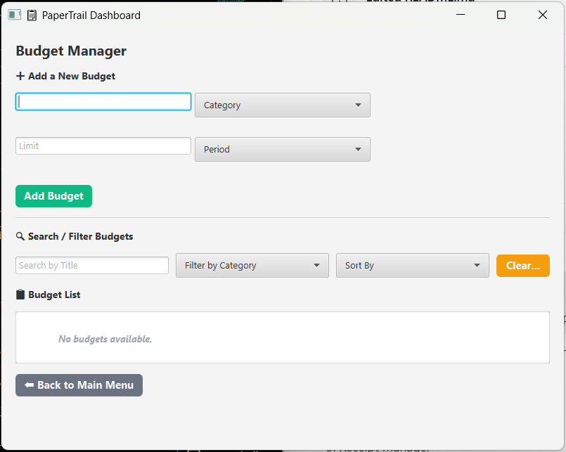
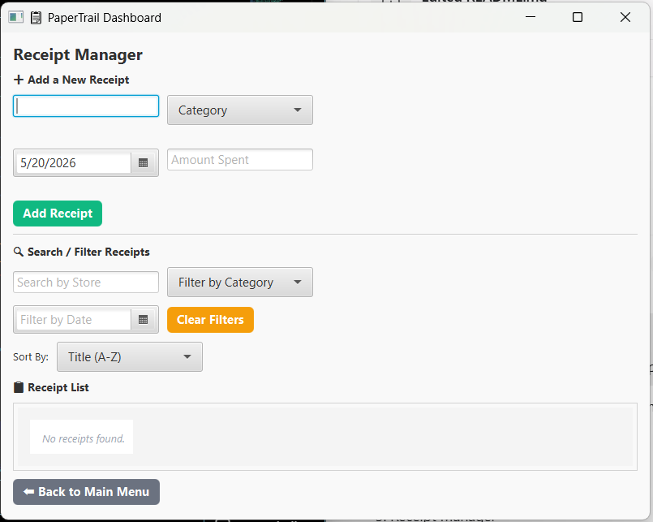
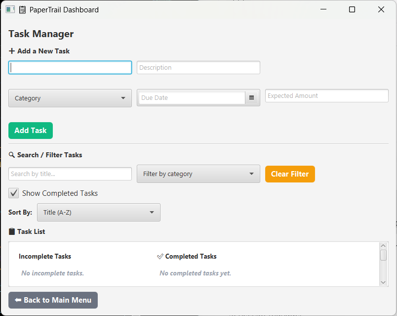

# PaperTrail

PaperTrail is a JavaFX desktop application for organizing personal budgets, receipts, and spending-related tasks in one place. The project is built as a portfolio application to demonstrate object-oriented Java, JavaFX UI development, MVC-style structure, validation, filtering, sorting, and file-based persistence.

The app is currently in active alpha development. The current focus is making the core desktop experience stable, readable, and easy to extend before adding larger features like OCR receipt scanning and analytics.

## Screenshots

### Main Menu



### Budget Manager



### Receipt Manager



### Task Manager



## Features

### Budget Manager

- Create budgets by title, category, limit, and reset period
- Track spent amount and remaining balance
- Filter budgets by title and category
- Sort budgets by title, limit, or reset period
- Edit and delete existing budgets
- Automatically reset budgets based on weekly, monthly, or yearly periods

### Receipt Manager

- Add receipts with store name, category, purchase date, and amount spent
- Link receipts to matching budgets by category
- Update budget spending when receipts are added or removed
- Filter receipts by store, category, and date
- Sort receipts by title, date, or amount
- Persist receipts to JSON files

### Task Manager

- Create spending-related tasks with title, description, category, due date, and expected amount
- Mark tasks complete or incomplete
- Show or hide completed tasks
- Filter tasks by title and category
- Sort tasks by title, due date, or expected amount
- Persist tasks to JSON files

## Tech Stack

- Java 8
- JavaFX
- FXML
- CSS
- Jackson for JSON serialization
- Git and GitHub

## Architecture

PaperTrail uses a simple MVC-style structure:

```text
src/
  papertrail/
    controller/   JavaFX controller logic
    model/        Budget, Receipt, Task, Category, BudgetPeriod
    service/      Business logic managers
    storage/      JSON save/load helpers
    style/        JavaFX CSS files
  resources/
    view/         FXML layouts
```

The application separates UI layout, controller behavior, model objects, service logic, and persistence helpers so each part can evolve independently.

## How To Run

### Requirements

- JDK 8
- Windows PowerShell or VS Code terminal
- The bundled Jackson `.jar` files in the `lib/` folder

Java 8 is used because it includes JavaFX by default. A future upgrade to Java 17 or Java 21 would require adding OpenJFX as a separate dependency.

### Compile

From the project root:

```powershell
cd C:\Users\santi\OneDrive\Desktop\PaperTrailApp\PaperTrailApp
& 'C:\Program Files\Java\jdk-1.8\bin\javac.exe' -encoding UTF-8 -cp '.\lib\*' -d .\out ((Get-ChildItem -Recurse -Filter *.java -Path .\src).FullName)
```

### Run

```powershell
& 'C:\Program Files\Java\jdk-1.8\bin\java.exe' -cp '.\out;.\src;.\lib\*' papertrail.PaperTrailApp
```

You can also run `PaperTrailApp.java` directly from VS Code after opening this folder:

```text
C:\Users\santi\OneDrive\Desktop\PaperTrailApp\PaperTrailApp
```

## Running Backend Tests

PaperTrail includes a simple backend smoke test runner for the core service logic.

Compile the project first:

```powershell
& 'C:\Program Files\Java\jdk-1.8\bin\javac.exe' -encoding UTF-8 -cp '.\lib\*' -d .\out ((Get-ChildItem -Recurse -Filter *.java -Path .\src).FullName)
```

Then run:

```powershell
& 'C:\Program Files\Java\jdk-1.8\bin\java.exe' -cp '.\out;.\lib\*' papertrail.BackendTests
```

The test runner checks task, budget, and receipt manager behavior and prints pass/fail output in the terminal.

## Data Persistence

PaperTrail stores user data locally as JSON:

```text
data/budgets.json
data/receipts.json
data/tasks.json
```

These files are created automatically when data is saved.

## Development Status

Current status: active alpha development.

Completed so far:

- JavaFX/FXML screen structure
- Budget, receipt, and task workflows
- Input validation
- Filtering and sorting
- JSON persistence with Jackson
- CSS styling for the main views
- JDK 8-compatible compile setup

Planned improvements:

- Add a demo GIF to the README
- Add automated backend tests
- Improve JSON data integrity checks
- Add dashboard/summary analytics
- Add receipt image upload and OCR integration
- Add a formal Maven or Gradle build
- Upgrade to a newer Java version with OpenJFX configured

## What I Learned

This project has helped me practice building a larger Java application beyond isolated exercises. The main learning areas include:

- Designing object-oriented models and service classes
- Connecting JavaFX controllers to FXML views
- Managing UI state across multiple screens
- Validating user input in desktop forms
- Persisting Java objects to JSON with Jackson
- Keeping GitHub branches and project structure organized
- Debugging compiler errors caused by Java version mismatches

## Repository Notes

The active branch for development is `main`.

Older branch history exists from earlier project iterations, but current work should continue from `main` to keep the project easy to follow.
